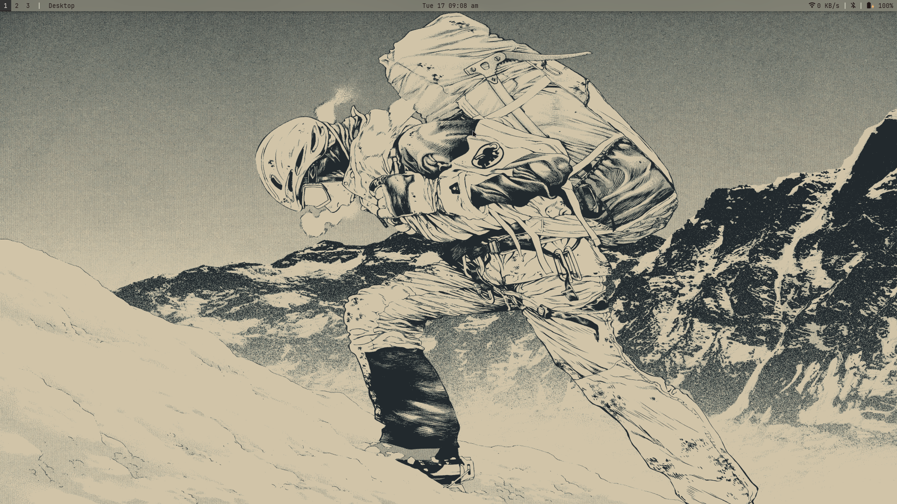
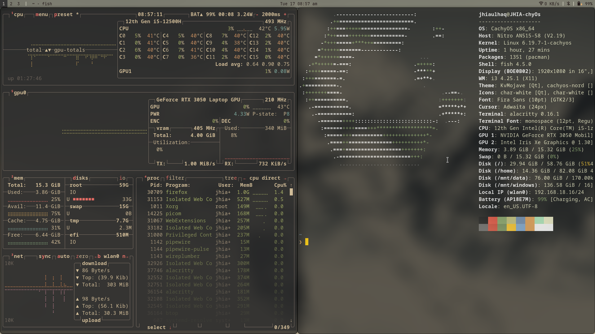

# 🍂 JHIA's Dotfiles | Gruvbox Setup

Welcome to my personal dotfiles repository! This setup is designed for efficiency, aesthetics, and performance on **CachyOS**, running the **i3 Window Manager**. 

The theme is inspired by the "Autumn" color palette and "Gruvbox," focusing on earthy, warm tones that are easy on the eyes during long coding sessions.

---

## 💻 Specifications
* **OS:** [CachyOS](https://cachyos.org/) (Arch-based)
* **WM:** i3wm
* **Compositor:** Picom (v13+)
* **Terminal:** Alacritty
* **Shell:** Zsh with Oh My Zsh

---

## 🎨 Theme Highlights
* **Colorscheme:** Custom Autumn / Everforest
* **Icons:** [Gruvbox Plus](https://aur.archlinux.org/packages/gruvbox-icon-theme-git)
* **Fonts:** JetBrainsMono Nerd Font
* **Rofi:** Custom Squared Theme (No rounded corners)
* **Visuals:** Subtle transparency with Dual Kawase blur

---

## 📂 Repository Structure
| File / Directory | Description |
| :--- | :--- |
| `i3/` | Keybinds, workspaces, and window rules |
| `alacritty/` | Terminal configuration with Autumn colors |
| `polybar/` | Status bar configuration |
| `rofi/` | Application launcher themes |
| `gtk-3.0/` | GTK theme and icon settings |
| `picom.conf` | Blur, transparency, and shadow settings |
| `.zshrc` | Shell aliases and autosuggestion settings |

---

## 🎨 Sources & Credits
To achieve this look, I use the following amazing themes and resources:

* **Rofi Theme:** [Squared Everforest](https://github.com/newmanls/rofi-themes-collection) by newmanls
* **GTK Theme:** [Gruvbox GTK Theme](https://github.com/Fausto-Korpsvart/Gruvbox-GTK-Theme) by Fausto-Korpsvart
* **Icons:** [Gruvbox Plus](https://aur.archlinux.org/packages/gruvbox-icon-theme-git) (Available on AUR)
* **Fonts:** JetBrainsMono Nerd Font

---

## 📸 Screenshoot




## 🚀 Installation & Setup

1. **Clone the repository:**
   ```bash
   git clone https://github.com/JHIA/myDotfiles.git
